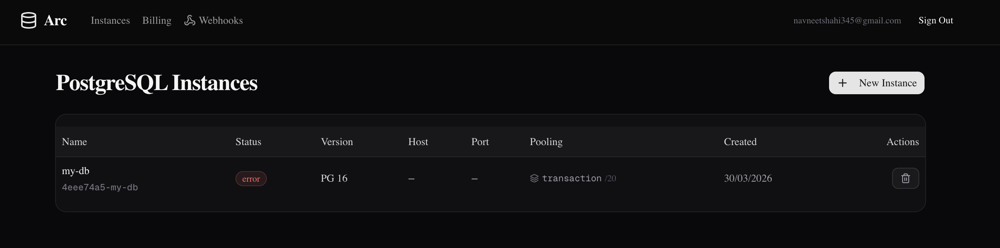
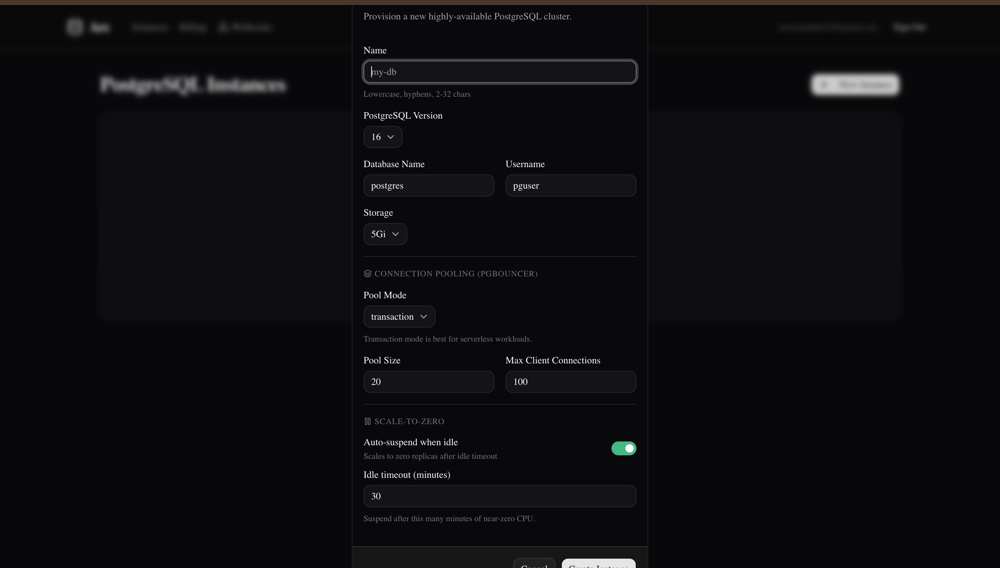
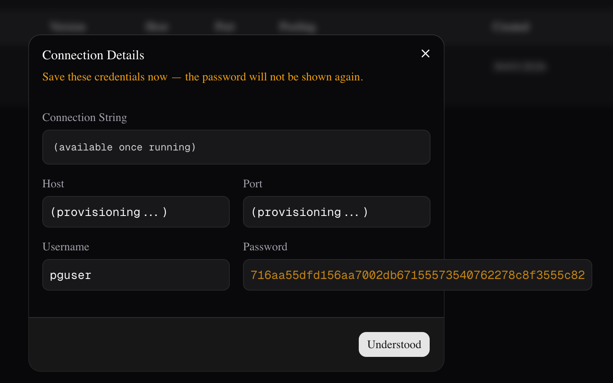
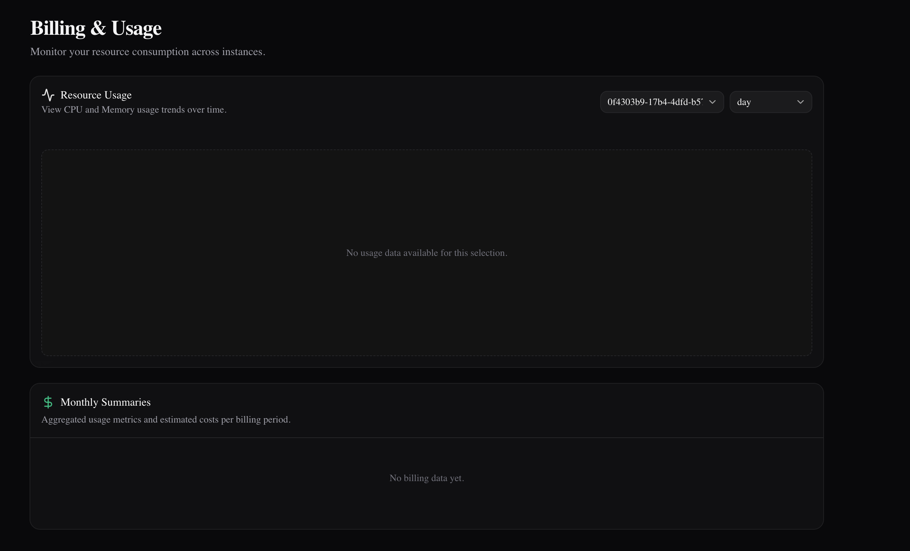
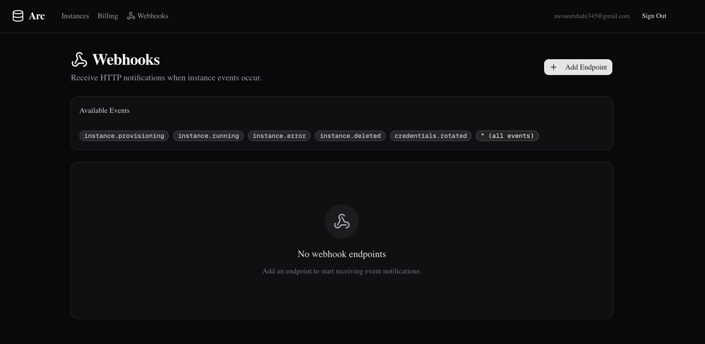

# Arc — Serverless PostgreSQL Platform

> Self-hosted serverless PostgreSQL as a Service, running on AWS EKS.
> Provision isolated, production-ready PostgreSQL clusters on demand — connection pooling, scale-to-zero, read replicas, PITR, webhooks, and a full dashboard.

**Inspired by:** Neon · Supabase · Render Postgres

---

## Architecture

(docs/screenshots/Serverless_arch.png)

---

## Live Dashboard

### PostgreSQL Instances



Manage all your PostgreSQL clusters from one view — status, version, host, port, pooling config, and creation date.

### New Instance — Provisioning Form



Configure PostgreSQL version, storage, PgBouncer pool mode (session / transaction / statement), pool size, max client connections, and scale-to-zero idle timeout in a single form.

### Connection Details



After provisioning, Arc returns a one-time password and full connection string. The password is never stored in the control plane — rotate it any time via the API or dashboard.

### Billing & Usage



CPU and memory metrics are collected every 60 seconds per instance using the Kubernetes Metrics Server. Monthly summaries aggregate usage into estimated cost breakdowns.

### Webhooks



Subscribe HTTP endpoints to lifecycle events. Arc delivers HMAC-SHA256 signed payloads with automatic retry (3 attempts, exponential backoff: 5s → 25s → 125s).

---

## Features

| Feature                    | Description                                                                        |
| -------------------------- | ---------------------------------------------------------------------------------- |
| **On-demand provisioning** | Create a PostgreSQL cluster in seconds via API or dashboard                        |
| **Full isolation**         | Each instance has its own K8s namespace, StatefulSet, PVC, Secret, and credentials |
| **PgBouncer sidecar**      | Connection pooler on port 6432 — session, transaction, or statement mode           |
| **Scale-to-zero**          | StatefulSet scaled to 0 replicas after idle timeout; auto-resumes on demand        |
| **Read replicas**          | PostgreSQL streaming replication; replicas as separate StatefulSets                |
| **PITR**                   | WAL archiving to S3; restore to any point in time                                  |
| **Webhooks**               | HMAC-SHA256 signed events; 3 retries with exponential backoff                      |
| **Metering**               | CPU/memory sampled every 60s via Kubernetes Metrics Server                         |
| **Billing**                | Monthly usage aggregation with cost estimates                                      |
| **Admin panel**            | User management, instance oversight, billing trigger                               |
| **HPA**                    | Arc API auto-scales 2–10 pods on CPU/memory pressure                               |
| **PodDisruptionBudget**    | Minimum 1 API pod always available during node drain                               |

---

## Technology Stack

### Control Plane

| Component       | Technology                                   |
| --------------- | -------------------------------------------- |
| API framework   | FastAPI (Python 3.12) + Uvicorn              |
| Database ORM    | SQLAlchemy 2.0 async + asyncpg               |
| Auth            | JWT (python-jose) + bcrypt                   |
| Background jobs | APScheduler — metering, billing, idle checks |
| Migrations      | Alembic (async)                              |
| Config          | pydantic-settings                            |

### Infrastructure

| Component          | Technology                                             |
| ------------------ | ------------------------------------------------------ |
| Kubernetes         | Amazon EKS 1.31 — managed node group (t3.medium × 3)   |
| Container registry | Amazon ECR                                             |
| Control plane DB   | Amazon RDS PostgreSQL 16 (db.t3.micro, gp3, encrypted) |
| Block storage      | AWS EBS gp3 (EBS CSI driver)                           |
| Load balancer      | AWS Classic ELB                                        |
| IaC                | Terraform ≥ 1.6 (VPC · EKS · RDS · ECR modules)        |
| Terraform state    | S3 + DynamoDB lock                                     |

### Per-Instance Stack

| Component         | Technology                                  |
| ----------------- | ------------------------------------------- |
| Database          | PostgreSQL 16-alpine (StatefulSet)          |
| Connection pooler | PgBouncer sidecar (port 6432)               |
| Replication       | PostgreSQL streaming replication            |
| Storage           | AWS EBS gp3 PersistentVolumeClaim           |
| Isolation         | Dedicated Kubernetes namespace per instance |

### Frontend & CI/CD

| Component | Technology                                                |
| --------- | --------------------------------------------------------- |
| Dashboard | Next.js 14 (static export → FastAPI StaticFiles at `/ui`) |
| Docker    | Multi-stage: Node 20-alpine → Python 3.12-slim            |
| Tests     | pytest + pytest-asyncio + postgres:16 service container   |
| Pipeline  | GitHub Actions: test → ECR push → migrate → EKS deploy    |

---

## How It Works

### Provisioning Flow

```
POST /instances
    │
    ├─► Create DB record  (status: provisioning)
    ├─► Return 202 + one-time password
    │
    └─► Background task:
            Namespace → Secret → PVC → StatefulSet → Services
            Poll readiness  →  status: running
            Fire webhook: instance.running
```

### Scale-to-Zero

APScheduler checks CPU metrics every minute. If idle past `idle_timeout_minutes`:

1. `StatefulSet.replicas = 0` — pods stop, PVC retained
2. Status → `suspended`
3. On `POST /instances/{id}/resume` → replicas back to 1, ready in ~15s

### PgBouncer Connection Pooling

Each instance runs two containers in the same pod:

- **postgres** on port 5432 — accepts connections from PgBouncer only
- **pgbouncer** on port 6432 — clients connect here; pools connections to postgres

**Transaction mode** (default) returns connections to the pool after each transaction — optimal for serverless workloads where connections spike unpredictably.

### Webhooks

```
Event fires (e.g. instance.running)
    │
    ├─► Query active endpoints subscribed to event
    ├─► Create WebhookDelivery records
    ├─► Sign payload: sha256=HMAC(secret, body)
    └─► POST to endpoint URL
            Retry on failure: 5s → 25s → 125s
            Record status + response per attempt
```

---

## Repository Structure

```
.
├── api/
│   ├── main.py                # App factory, lifespan, scheduler
│   ├── auth/                  # Register, login, JWT
│   ├── instances/             # CRUD, provisioning, scale-to-zero, replicas, PITR
│   ├── admin/                 # Admin panel
│   ├── billing/               # Usage queries, monthly summaries
│   ├── metering/              # APScheduler collectors
│   ├── webhooks/              # HMAC dispatch, retry engine
│   ├── k8s/                   # Manifest builders, provisioner, K8s client
│   └── db/
│       ├── models/            # All SQLAlchemy models
│       └── migrations/        # Alembic async migrations
├── frontend/                  # Next.js 14 dashboard
├── k8s/
│   ├── namespace.yaml
│   ├── storageclass.yaml      # gp3 default StorageClass
│   ├── metrics-server.yaml
│   ├── migration-job.yaml     # One-off Alembic Job
│   ├── api-deployment.yaml    # Deployment + HPA + PDB + Service
│   └── rbac.yaml              # ClusterRole for arc-api ServiceAccount
├── terraform/
│   ├── modules/ (vpc · eks · rds)
│   └── terraform.tfvars
├── .github/workflows/deploy.yml
├── Dockerfile
└── requirements.txt
```

---

## Deployment

### Prerequisites

- AWS account · IAM user with AdministratorAccess
- Terraform ≥ 1.6, AWS CLI, kubectl, Docker, `gh`

### 1 — Bootstrap state backend

```bash
ACCOUNT_ID=$(aws sts get-caller-identity --query Account --output text)
aws s3 mb s3://arc-tfstate-${ACCOUNT_ID} --region us-east-1
aws dynamodb create-table \
  --table-name terraform-state-lock \
  --attribute-definitions AttributeName=LockID,AttributeType=S \
  --key-schema AttributeName=LockID,KeyType=HASH \
  --billing-mode PAY_PER_REQUEST --region us-east-1
```

### 2 — Provision infrastructure

```bash
cd terraform && terraform init && terraform apply -auto-approve
```

### 3 — Configure kubectl

```bash
aws eks update-kubeconfig --region us-east-1 --name arc-cluster
```

### 4 — Apply Kubernetes resources

```bash
kubectl apply -f k8s/namespace.yaml
kubectl apply -f k8s/storageclass.yaml
kubectl apply -f k8s/metrics-server.yaml
kubectl apply -f k8s/rbac.yaml
kubectl apply -f k8s/api-deployment.yaml
```

### 5 — Create API secret

```bash
kubectl create secret generic arc-api-env -n arc-system \
  --from-literal=DATABASE_URL='postgresql+asyncpg://<user>:<pass>@<rds-endpoint>:5432/arc_control' \
  --from-literal=SECRET_KEY="$(openssl rand -hex 32)" \
  --from-literal=ENVIRONMENT="prod" \
  --from-literal=STORAGE_CLASS="gp3"
```

### 6 — Deploy via GitHub Actions

```bash
gh secret set AWS_ACCESS_KEY_ID
gh secret set AWS_SECRET_ACCESS_KEY
gh workflow run deploy.yml
```

### 7 — Get your endpoint

```bash
kubectl get svc arc-api -n arc-system \
  -o jsonpath='{.status.loadBalancer.ingress[0].hostname}'
```

---

## API Reference

Full docs at `http://<endpoint>/docs`

| Method | Path                                    | Description               |
| ------ | --------------------------------------- | ------------------------- |
| POST   | `/auth/register`                        | Create account            |
| POST   | `/auth/login`                           | Get JWT token             |
| GET    | `/instances`                            | List instances            |
| POST   | `/instances`                            | Create instance (202)     |
| DELETE | `/instances/{id}`                       | Delete instance           |
| POST   | `/instances/{id}/suspend`               | Scale to zero             |
| POST   | `/instances/{id}/resume`                | Resume from zero          |
| POST   | `/instances/{id}/credentials/rotate`    | Rotate password           |
| POST   | `/instances/{id}/backups`               | Create backup             |
| POST   | `/instances/{id}/backups/{bid}/restore` | Point-in-time restore     |
| POST   | `/instances/{id}/replicas`              | Add read replica          |
| GET    | `/billing/usage`                        | CPU/memory metrics        |
| GET    | `/billing/summary`                      | Monthly cost summary      |
| POST   | `/webhooks/endpoints`                   | Register webhook endpoint |
| GET    | `/admin/stats`                          | Platform stats (admin)    |
| GET    | `/health`                               | Health check              |

---

## Environment Variables

| Variable                 | Description                                  |
| ------------------------ | -------------------------------------------- |
| `DATABASE_URL`           | Control-plane DB connection string (asyncpg) |
| `SECRET_KEY`             | JWT signing secret (32-byte hex)             |
| `K8S_IN_CLUSTER`         | `true` when running inside a pod             |
| `ENVIRONMENT`            | `dev` (NodePort) · `prod` (LoadBalancer)     |
| `STORAGE_CLASS`          | `standard` (minikube) · `gp3` (EKS)          |
| `SCALE_TO_ZERO_ENABLED`  | Enable idle instance suspension              |
| `METERING_INTERVAL_SECS` | Metrics collection interval (default: `60`)  |

---

## Author

**Navneet Shahi**

Built end-to-end — API design, Kubernetes operator logic, Terraform infrastructure, CI/CD pipeline, and Next.js dashboard. Deployed live on AWS EKS.

---

## License

MIT
